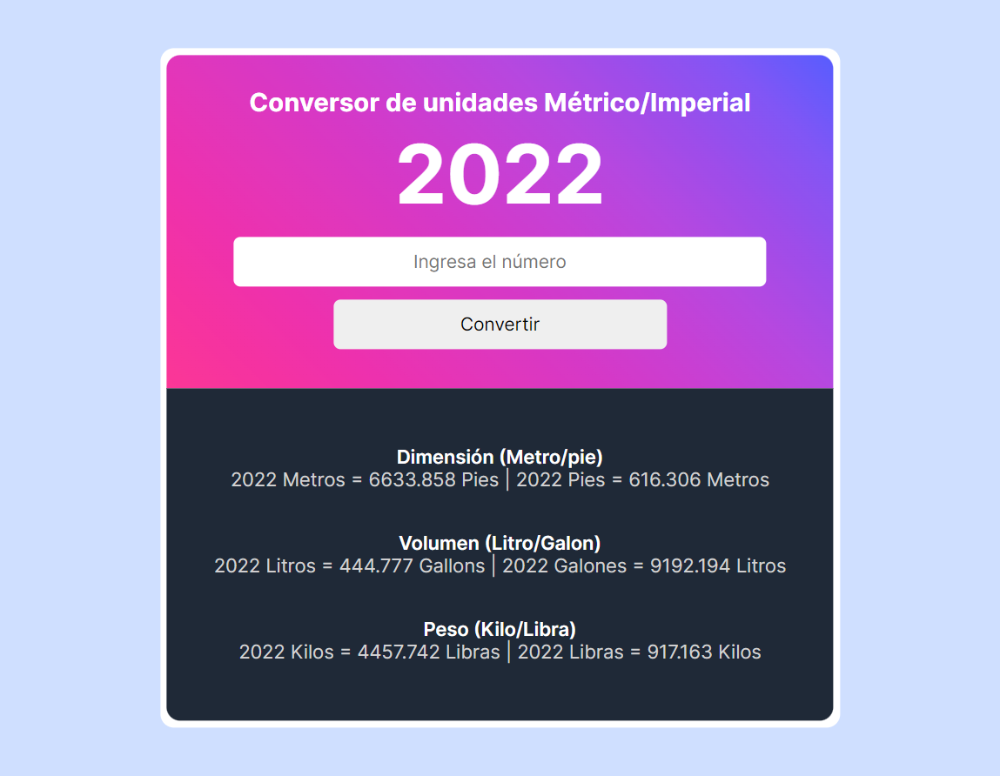

# Conversor de unidades Métrico / Imperial

## Tabla de contenidos

- [Conversor de unidades Métrico / Imperial](#conversor-de-unidades-métrico--imperial)
  - [Tabla de contenidos](#tabla-de-contenidos)
  - [Descripción](#descripción)
  - [Captura de pantalla](#captura-de-pantalla)
  - [Links](#links)
  - [Construido con](#construido-con)
  - [Autor](#autor)

## Descripción
Este proyecto de Javascript forma parte del Curso "Learn Javascript" de Scrimba. El diseño fue provisto en Figma.

## Captura de pantalla

## Links

- Repositorio: [https://github.com/creativoma/conversor-unidades](https://github.com/creativoma/conversor-unidades)
- Despliegue: [https://creativoma.github.io/conversor-unidades/](https://creativoma.github.io/conversor-unidades)

## Construido con

- HTML
- CSS 
- Javascript

## Autor

- Github - [creativoma](https://github.com/creativoma)
- Linkedin - [in/ma-marianoalvarez/](https://www.linkedin.com/in/ma-marianoalvarez/)

